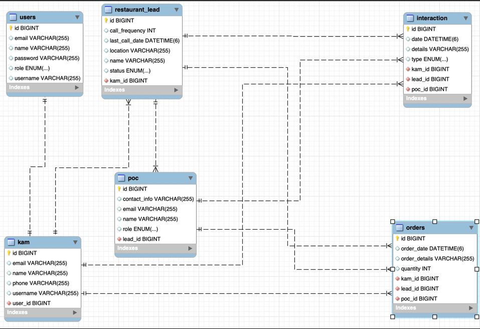

# Key-Account-Manager-Lead-Management-System

## 1. Project Overview

The KAM Lead Management System is a comprehensive platform designed for Key Account Managers (KAMs) and Admins to manage leads, interactions, and call schedules efficiently. It provides role-based access control, ensuring that only authorized users can perform specific actions. The system stores all date/time values in UTC and provides features such as lead management, interaction tracking, and performance monitoring.

### Key features:

#### 1. Lead Management

- **Add New Restaurant Leads**
  - **Authorized Role:** ADMIN
  - **API:** POST /api/leads
  - **Description:** Allows admins to add new restaurant leads.
  
- **Store Basic Lead/Restaurant Information**
  - **Authorized Role:** ADMIN, KAM (view-only)
  - **API:**
    - GET /api/leads (view leads by status)
    - PUT /api/leads/{id} (update details, Admin only)
    - **Description:** Admins can update restaurant information, and KAMs can view leads assigned to them.
- **Track Lead Status**
  - **Authorized Role:** ADMIN, KAM
  - **API:**
    - GET /api/leads (view by status)
    - PUT /api/leads/{id} (update, Admin only)
    - **Description:** Track and update the status of leads.

#### 2. Contact Management

- **Multiple Points of Contact (POCs) per Lead**
  - **Authorized Role:** ADMIN
  - **API:** POST /api/leads/{lead_id}/pocs
  - **Description:** Admins can add multiple POCs with details like name, role, and contact information for a restaurant.
  
- **View POCs for a Lead**
  - **Authorized Role:** ADMIN, KAM (only if assigned to the lead)
  - **API:** GET /api/leads/{lead_id}/pocs
  - **Description:** Retrieve all POCs for a restaurant. KAMs can only access their assigned leads' POCs.
  
#### 3. Interaction Tracking

- **Record All Interactions / Orders Made to Leads**
  - **Authorized Role:** KAM (only if assigned to the lead)
  - **API:** POST /api/leads/{lead_id}/interactions _(non order interactions)_
  - **API:** POST /api/leads/{lead_id}/orders
  - **Description:** Record all interactions/orders (between a lead and POC) with details for tracking.
  
- **Track Interactions / Orders Placed**
  - **Authorized Role:** ADMIN, KAM (only if assigned to the lead)
  - **API:** GET /api/leads/{lead_id}/interactions
  - **API:** GET /api/leads/{lead_id}/orders
  - **Description:** Track interactions / orders placed.

#### 4. Call Planning

- **Set Call Frequency for Each Lead**
  - **Authorized Role:** ADMIN
  - **API:** PUT /api/leads/{id} (update lead details)
  - **Description:** Set the frequency of calls required for each lead.
- **Display Leads Requiring Calls Today**
  - **Authorized Role:** ADMIN, KAM (only leads managed by that KAM)
  - **API:** GET /api/leads/requiring-call-today
  - **Description:** Lists leads that are due for calls based on frequency and last call date.

#### 5. Performance Tracking

- **Track Well-Performing Accounts**
  - **Authorized Role:** ADMIN
  - **API:** GET /api/leads/well-performing
  - **Description:** Identify leads performing well based on specific order thresholds.
- **Monitor Ordering Patterns and Frequency**
  - **Authorized Role:** ADMIN
  - **API:** GET /api/leads/performance
  - **Description:** Fetch and analyze lead performance based on orders.
- **Identify Under-performing Accounts**
  - **Authorized Role:** ADMIN
  - **API:** GET /api/leads/under-performing
  - **Description:** Identify accounts that are not meeting expected order threshold.

Summary of Authorization:

|                           Feature	Endpoint                           |        Admin         |        KAM        |
|:--------------------------------------------------------------------:|:---------------:|:-----------------:|
|             View all key account managers	GET /api/kams              | ✅ |         ❌         |
|                    Add New Leads	POST /api/leads                     | ✅ |         ❌         |
|                      View Leads	GET /api/leads                       |    ✅     | ✅ (assigned only) |
|             Update Lead Information	PUT /api/leads/{id}              |    ✅     |         ❌         |
|  Reassign KAM for a lead	PUT /api/leads/{id}/reassign?newKamId={id}  |    ✅     |         ❌         |
|               Add POCs	POST /api/leads/{lead_id}/pocs                |    ✅     |         ❌         |
|               View POCs	GET /api/leads/{lead_id}/pocs                |    ✅     | ✅ (assigned only) |
| View Leads Requiring Calls Today	GET /api/leads/requiring-call-today |    ✅     |         ✅         |
|      Record Interactions	POST /api/leads/{lead_id}/interactions      |    ❌     |         ✅         |
|       View Interactions	GET /api/leads/{lead_id}/interactions        |    ✅     |         ✅         |
|            Create Order	POST /api/leads/{lead_id}/orders             |    ❌     |         ✅         |
|             View Orders	GET /api/leads/{lead_id}/orders              |    ✅     |         ✅         |
|         Monitor Ordering Patterns	GET /api/leads/performance         |    ✅     |         ❌         |
|    Track Well-Performing Accounts	GET /api/leads/well-performing     |    ✅     |         ❌         |
|  Identify Underperforming Accounts	GET /api/leads/under-performing   |    ✅     |         ❌         |

  
### ER diagram for KAM lead management system
Diagram
                      

## 2. System Requirements

- Java: Version 17 or higher
- Spring Boot: Version 3.x
- Database: MySQL 8.0+
- Build Tool: Gradle 7.x or higher
- Other Tools: Postman (for API testing), Docker (optional for containerization)

## 3. Installation Instructions

### Clone the Repository

```
git clone https://github.com/your-repo/kam-lead-management.git
cd kam-lead-management
```

### Configure the Application

Step 1: Install MySQL

Step 2: Verify MySQL Installation:

After installation, verify MySQL is running by entering:

```
mysql -u root -p
```
This should prompt for the root password you configured and open the MySQL shell.

Step 3: Configure MySQL Database for the Application
```
CREATE DATABASE kam_lead_management;
```

Step 4: Configure Application to Use MySQL Database
In your application’s application.properties (or application.yml), configure the connection details to connect to MySQL:

```
spring.datasource.url=jdbc:mysql://localhost:3306/kam_lead_db
spring.datasource.username=root
spring.datasource.password=yourpassword
spring.jpa.hibernate.ddl-auto=update
spring.jpa.properties.hibernate.dialect=org.hibernate.dialect.MySQLDialect

jwt.secret=your-jwt-secret-key (base 64 encoded key)
```

## 4. Building the Project

Build with Gradle
Run the following command to build the project:

```
./gradlew build
```

Running the Application
Start the application using:

```
./gradlew bootRun
```

By default, the application will start at http://localhost:8080.

## 5. Running Instructions

- Access the API: Use tools like Postman or any HTTP client to interact with the APIs.
- Role-Based Access:
  - Admin: Can manage all users, leads, interactions, and view reports.
  - KAM: Can manage leads and interactions assigned to them.
- Endpoints Overview: See the API Documentation section for detailed endpoint information.

## 6. API Documentation

Swagger UI is integrated into the project. Once the application is running, visit the following URL for API documentation:

http://localhost:8080/swagger-ui/index.html

## 7. Sample Usage Examples

Signup Endpoint: POST /api/signup
```
Request Body:

  {
    "username": "john.doe",
    "password": "password123",
    "role": "KAM",
    "email": "john.doe@example.com"
  }
  
Response:

  {
    "id": 2,
    "username": "john.doe",
    "role": "KAM",
    "message": "KAM created successfully"
}
```
Login Endpoint: POST /api/login

```
Request Body:

  {
    "username": "john.doe",
    "password": "password123"
  }
  
Response:

Headers: Authorization: <JWT Token>

Body:

  "User logged in successfully"
  
 ```
Get Leads Endpoint: GET /api/leads

 ```
  Request header:
 
  Authorization : Bearer {JWT_TOKEN}

  Response:
  
    [
      {
        "id": 1,
        "name": "Lead 1",
        "status": "NEW",
        "callFrequency": 7,
        "lastCallDate": "2024-12-30T10:00:00Z"
      },
      {
        "id": 2,
        "name": "Lead 2",
        "status": "CONTACTED",
        "callFrequency": 14,
        "lastCallDate": "2024-12-25T10:00:00Z"
      }
    ]
 ```

## 8. Key Notes

- Time Zone Handling: All date/time fields are stored in UTC as Instant in the database and converted to the appropriate format in the response if needed.

- Error Handling: Errors are returned in a consistent format:
```
  {
    "timestamp": "2024-12-30T10:00:00Z",
    "status": 400,
    "message": "Invalid input",
    "details": "/api/leads"
  }
 ```